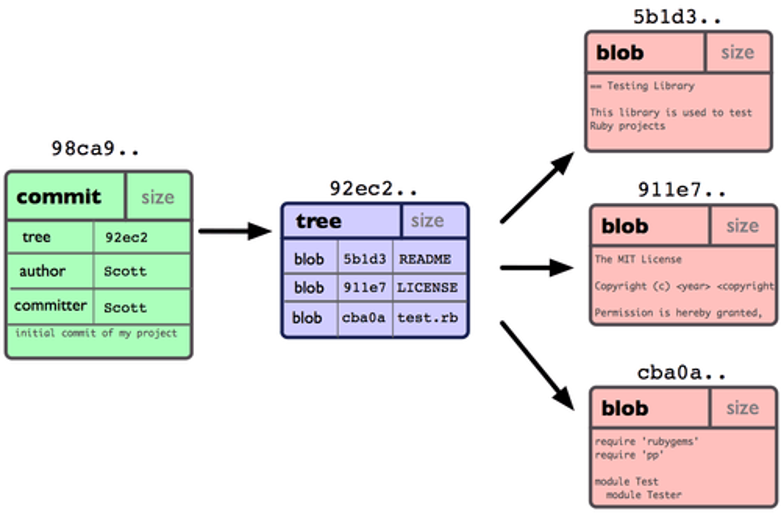
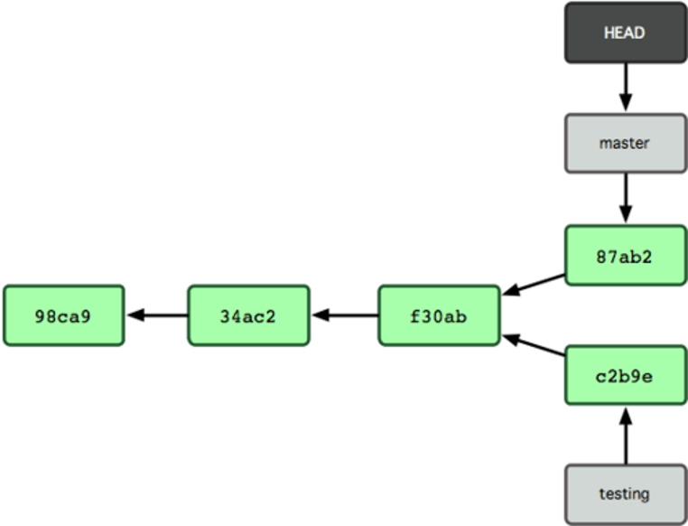
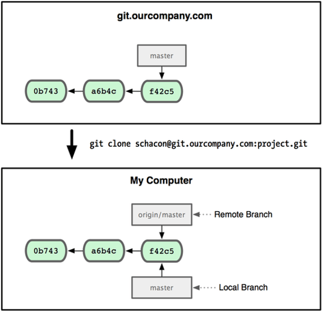
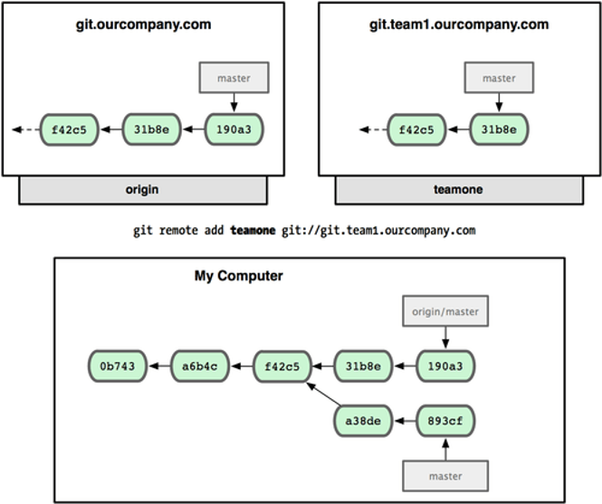
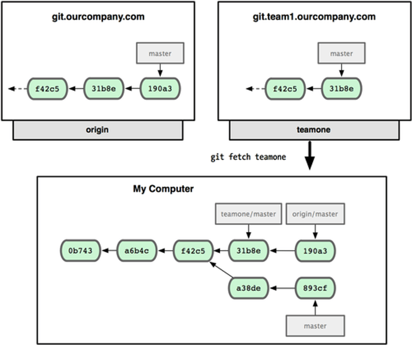
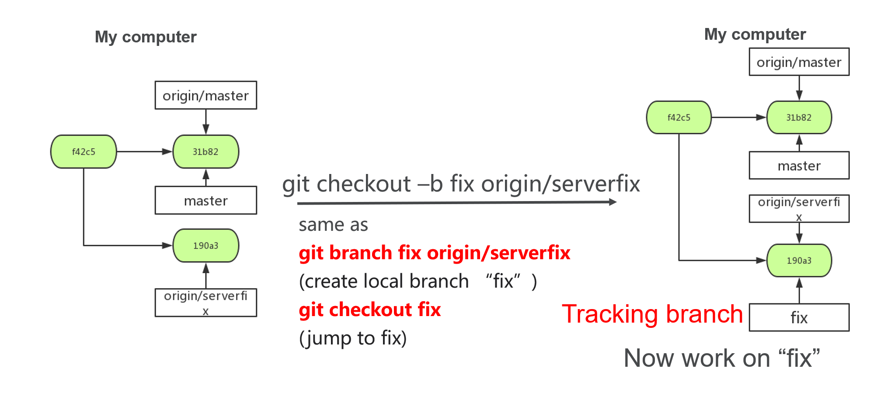

# Git
## Working with Remotes
##### 2018011295 Chen Yuxiang

---

## Review of Git

*  Each Commit has several binary large objects(blob), which save the change you made.

> You has modified three files here

    

 

* Several commits will become a tree. There are pointers of commits which called **branch**. Above all **branch**, there is a **HEAD** pointer pointed at the workspace.

> You have two branches which called "master" and "testing". You are working on master now.

 

## Remote Repository

## git clone

A **Remote Repository** is saved on remote Git server, like the GitHub

Use command **git clone [shortname] [url]** to get a copy

> Get a copy from **ourcompany**

 

## git remote add

Use command **git remote add [shortname] [url]** to add new remote repository.

 

## git fetch

Use **git fetch [shortname]** to get new branches and commits fron remote repository

 

## git checkout

Use **git checkout –b [name] [remote branch name]** can create a new remote branch

 

## git push

Use **git push [remote repository] [local branch]** to make contributions to remote repository

* For a tracking branch(“master” and “origin/master”), 
it will update the remote branch

* For a new branch, Add “local branch” to “remote repository”

>Notice:
If others **push** earlier, 
You can't execute **push** command unless you update your local repository.

## other command
* git pull = git fetch + git merge

* git remote rename [newname] [oldname] (rename a remote repository)

* git remote rm [name] (remove a remote repository)

>most of the commands act just like local repository.
