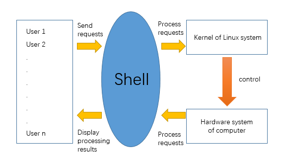
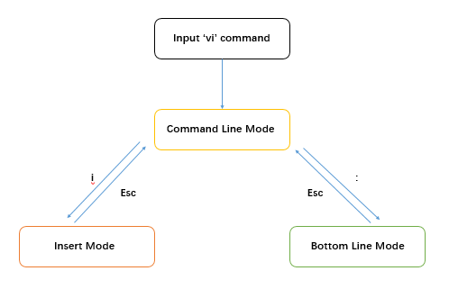

# A brief introduction to Bash Shell


## 1. Contents:

> * ### What is Shell?
>
> * ### Text editor in Shell
>
> * ### Frequently used commands in Shell


## 2. What is Shell?

> > ​	In Linux, Shell is just like **the shell of** **the Linux system**. (I think the one who named it used some kind of metaphor) It plays a protective role outside the Linux system, helping the interaction of data and information between users and Linux system. Because of Shell, the users will not ‘communicate’ directly with Linux. Instead, they use Shell as the **interpreter** and **middleman**, which greatly prevents hurting the kernel due to incorrect operation of users.
> >
> > ​	( Someone will consider shell similar as cmd in Windows. In fact, shell is far more powerful than cmd in many aspects. Or maybe...all the aspects? )
> >
> > ​	Also, Shell is a **programming language**. The source files of Shell are called the Shell Scripts.**(end with .sh)**
> >
> > ​	There are many variables and built-in parameters in Shell Scripts, and loop structure, branch structure as well. As a result, it can be used for automatic processing.



### Types of shell

 * Bourne Shell (the first shell that can be used, introduced in 1977)
 * Bash Shell (originated from Bourne Shell, Bourne-Again Shell)
 * C Shell (make it more convenient for C programmers to operate)
 * Korn Shell (mix the advantages of both Bourne Shell and C Shell)


## 3. Text editor in Linux

* Gedit, vi(vim), Emacs, etc.
    * Gedit is similar to the notepad in Windows, which needs graphic interface system.
    * Vi(vim) and Emacs editor can also work without a graphic
        interface, and even without a mouse.

* There are many commands in the usage of vi. But because of time limit, I will not describe it here. You can search on the Internet for particular commands.




## 4. Frequently used commands in Shell

---

* **cd**
> change your current directory

```shell
cd ..
cd __DIRECTORY_NAME__
```


* **ls ( -l -a -s -i)**
> show all the files and directories in your current directory

```shell
ls -l
ls
```


* **mkdir** 
>  make a new directory

```shell
mkdir new
```


* **touch**
> create a new file

```shell
touch a_new_file another_new_file
```


* **vi**
> go into the editor and edit the file

```shell
vi a_new_file
```


* **rm**
> remove a directory or a file. If you want to remove a directory, you should use “rm –r dir_name”

```shell
rm -r new
```


* **pwd**
> show the absolute path of your current directory

```bash
pwd
```


* **cat** 
> show the contents of a file

```shell
cat test.txt
```


* **tail**
> show the last n lines (use -n) or show from the n-th line to the end (use +n)

```shell
tail -2 test.txt
tail +2 test.txt
```


* **wc (-c -l -w -L -m etc.)**
> count something of a file such as the length of the longest line
or the number of lines or the number of the words of the file or something else.

```shell
wc -c test.txt
wc -l test.txt
```


* **file**

> get the type of a file

```shell
file test.txt
file test1.sh
```

---


#### Many other commands: ####

**find	grep	ping	chmod	chown	ipconfig/ifconfig**

**route	ps	netstat	top	man	df	fdisk	...**

## ***<u>Useful & Interesting!</u>***

***


> > Reference book: 《Linux Bash 编程与脚本应用实战》 清华大学出版社


## THE END!


