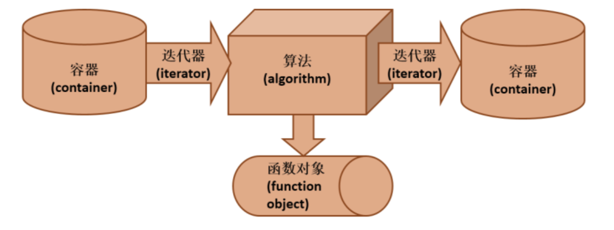
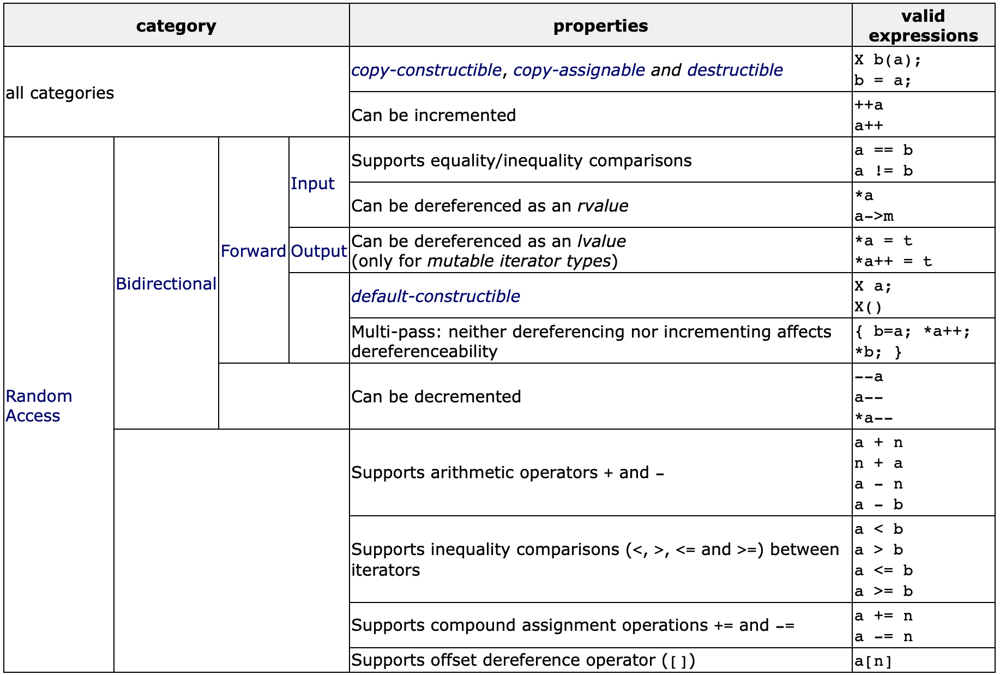

# Iterators in C++

Li Hangzhe | 20 June 2019

---

## Overview

* What is iterator?
* Why iterator?
* Operations
* Example: iostream iterator
* Category of iterators
* Example: stack class and stack iterator

## What is iterator?

In general, we can think of iterator as a generalized pointer. It is a method to traverse the container. Container, iterator, function object and algorithms are basic elements in STL(Standard Template Library).
> ...Provide a way to access the elements of an aggregate object sequentially without exposing its underlying representation.




## Why iterator?
- It is the bridge between algorithm and container
	- Iterator is used to visit elements in the container
	- Algorithm play with the iterator

- Algorithm and data structure decoupled
	- Implement new algorithm with old container.
	- New implement of container without modifying the algorithm.

> ...when users need additional functionality, if an iterator was originally provided, they can add functionality with "open for extension, closed for modification". 

## Operations

Iterator works just well as pointer.  

- the increment ++ `++iter` and `--iter`
- the dereference operator * `cout<< *iter <<endl;`
- the func operator -> `iter->func();`

2 iterators p1 and p2 can represent an interval [p1,p2)

```
for(auto i=vec.begin(); i!=vec.end(); ++i)
{
	//do sth.
}
```

## Example: iostream iterator
  
- `istream_iterator<T>`
	- Build by parameter like `cin`
	- `*(p++)` to get the next element in the input

- `ostream_iterator<T>`
	- Build by parameter like cout
	- `*(p++) =x` to output `x`


```c++
//This is an example to negate every number in a vector.
#include..

int main()
{
    vector<int> N(5);
    for(int i=0;i<5;i++) cin>>N[i];
    transform(s.begin(), s.end(), ostream_iterator<int>(cout," "),negate<int>() );
    cout<<endl;
    return 0;
}
```

```c++
//This example square every number from input.
#include..

double square(double x) {return x*x;}

int main()
{
	transform(istream_iterator<double>(cin), istream_iterator<double>(), ostream_iterator<double>(cout,"\t"),square);
	cout<<endl;
	return 0;
}
```

From above two examples, `vector<int> s` is the container, `transform` is the algorithm, `s.begin()`, `ostream_iterator<int>()` are iterators, `negate<int>()`, `square()` are function objects. We can use the same algorithm with different iterators and function objects! Algorithms in STL are designed to be generic. 

## Category of iterators

Input/Output <- Forward <- Bidirectional <- Random Access



[More detail](http://www.cplusplus.com/reference/iterator/) in c++ reference.


## Example: stack class and stack iterator


> The key idea is to take the responsibility for access and traversal out of the aggregate object and put it into an Iterator object that defines a standard traversal protocol.

This is a simple simulation of stack<int> and its iterator.

```c++
class Stack
{
private;
	 const int N = 1000;
    int items[N];
    int sp;
public:
    friend class StackIter;
    Stack()
    {
        sp =  - 1;
    }
    void push(int in)
    {
        items[++sp] = in;
    }
    int pop()
    {
        return items[sp--];
    }
    bool isEmpty()
    {
        return (sp ==  - 1);
    }
    StackIter* createIterator() const; 
};
```

> Every 'container-like' class must have an iterator.

```c++
class StackIter
{
    const Stack *stk;
    int index;
public:
    StackIter(const Stack *s)
    {
        stk = s;
    }
    void first()
    {
        index = 0;
    }
    void next()
    {
        index++;
    }
    bool isDone()
    {
        return index == stk->sp + 1;
    }
    int currentItem()
    {
        return stk->items[index];
    }
};

StackIter *Stack::createIterator()const
{
  return new StackIter(this);
}

//Apply StackIter to compare two stack.
bool operator == (const Stack &l, const Stack &r)
{
  StackIter *itl = l.createIterator();
  StackIter *itr = r.createIterator();
  for (itl->first(), itr->first(); !itl->isDone(); itl->next(), itr->next())
    if (itl->currentItem() != itr->currentItem())
      break;
  bool ans = itl->isDone() && itr->isDone();
  delete itl;
  delete itr;
  return ans;
}

int main()
{
  Stack s1;
  for (int i = 1; i < 5; i++)
    s1.push(i);
  Stack s2(s1), s3(s1), s4(s1), s5(s1);
  s3.pop();
  s5.pop();
  s4.push(2);
  s5.push(9);
  cout << "1 == 2 is " << (s1 == s2) << endl;
  cout << "1 == 3 is " << (s1 == s3) << endl;
  cout << "1 == 4 is " << (s1 == s4) << endl;
  cout << "1 == 5 is " << (s1 == s5) << endl;
}
```

## Further Readings

* iterator and const_iterator
* Underlying problem of iterator design pattern
	* Every data structure has to "abstract" the traversal so that algorithm can interface.

## Reference
1. <http://www.cplusplus.com/reference/iterator/>
2. <https://sourcemaking.com/design_patterns/iterator>
3. <https://sourcemaking.com/design_patterns/iterator/cpp/1>