#Testing with Google Test Framework
###Author: ¹ù¼Ñʤ 2018013387
###Department: School of Software
##Relative Code
###Install GTest
```bash
#!/bin/bash
git clone https://github.com/google/googletest.git
cd googletest

mkdir build
cd build
cmake ..

make
make install
```

##Slide Pages

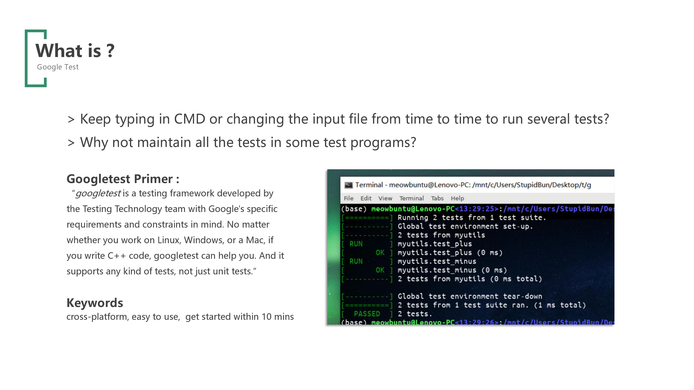
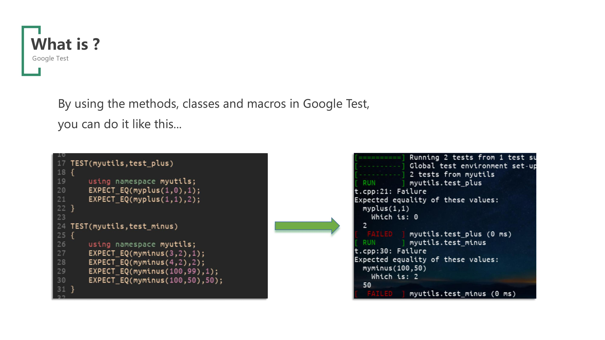
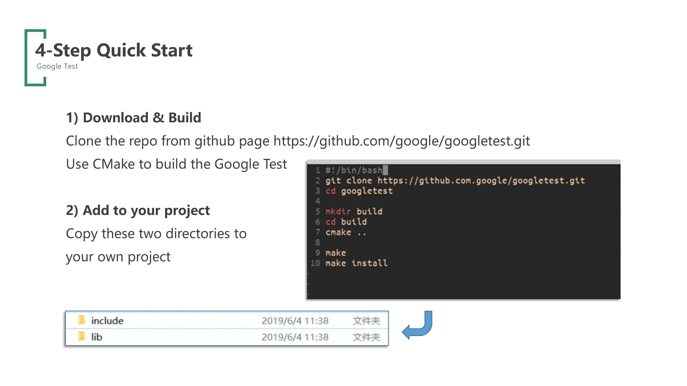
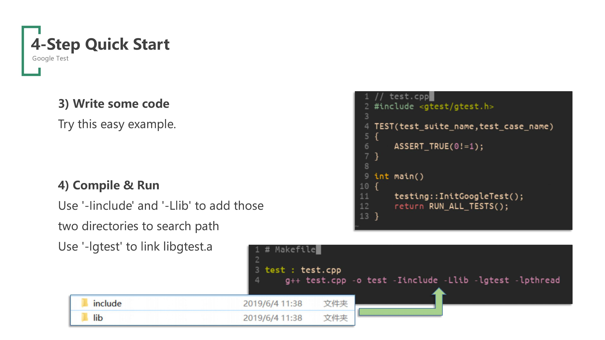
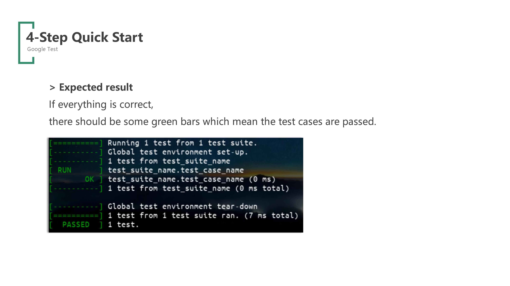
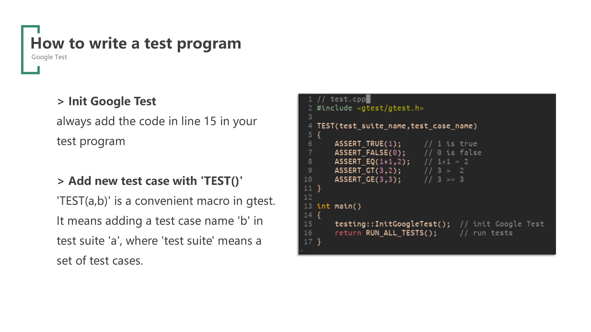
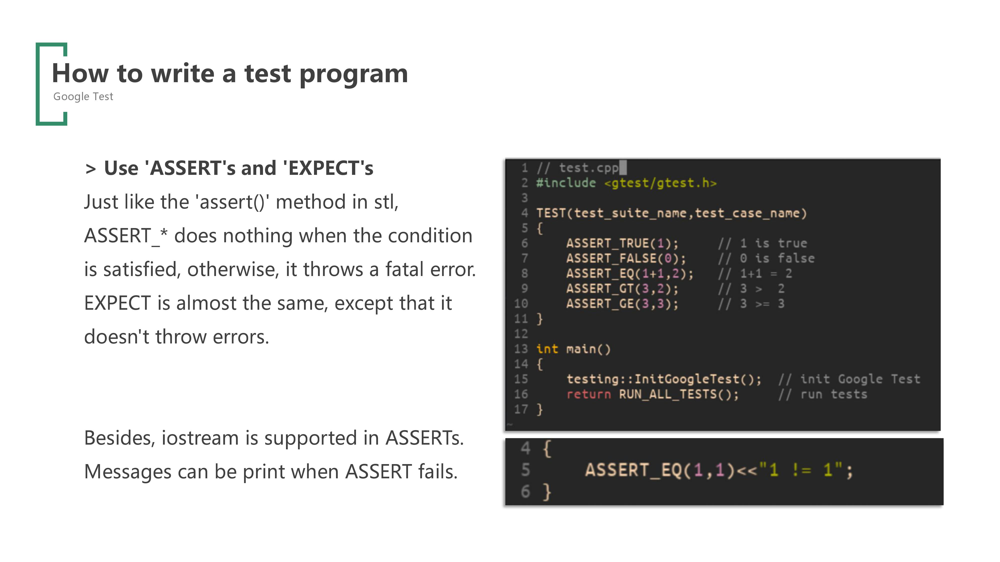
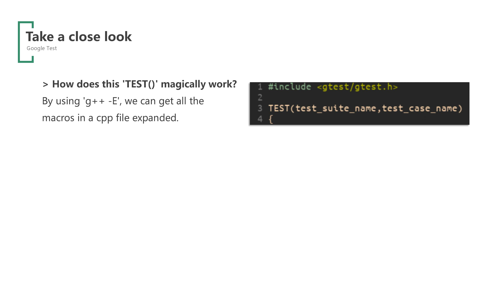
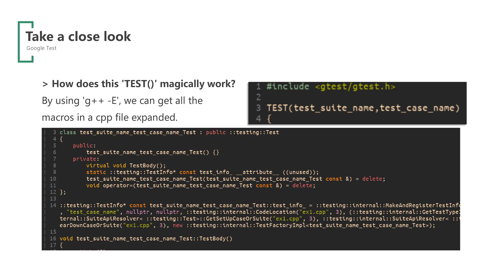
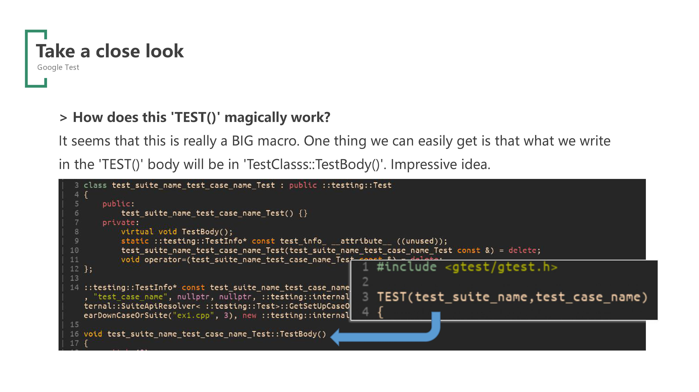
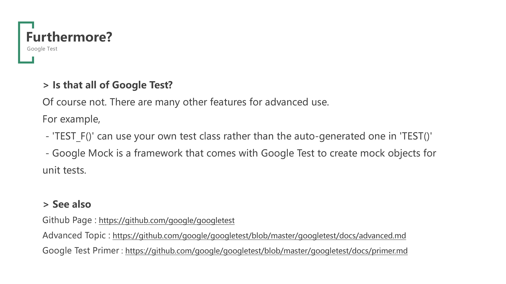

