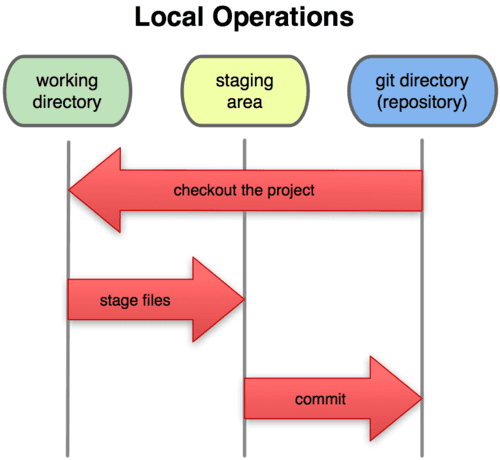
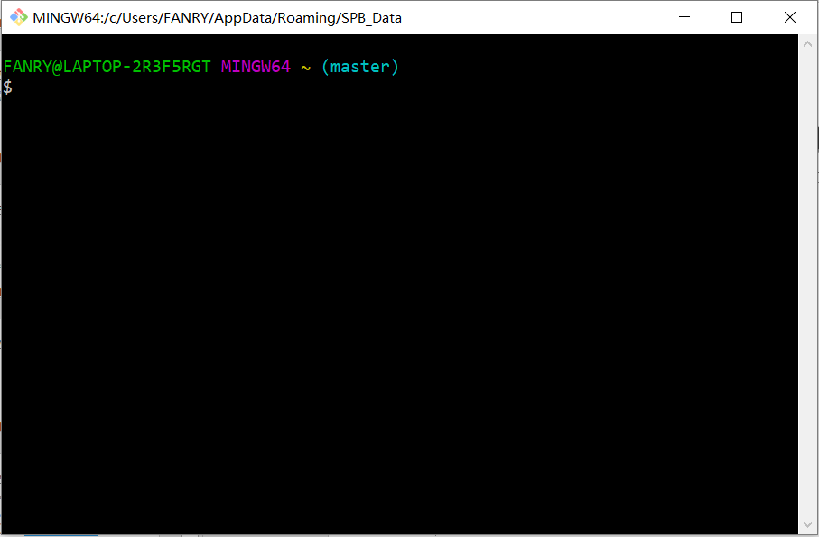
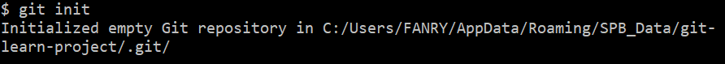

##A Brief Introduction to Git and Github
#####Fan Ruoyu

Git is a distributed version-control system for tracking changes in source code during software development. It is designed for coordinating work among programmers, but it can be used to track changes in any set of files. 
We have used several version control methods, just like save all the different versions of a file.

But such method is kind of cumbersome.Do we have any better ways?
The answer is yes. We will learn git as a useful tool helping us control our versions.

There are three area in git: the working directory, staging area ang git directory. We edit our files under the working directory, add them to the staging area, and eventually commit them to the git directory.
How to attach git? For Linux users, use the command
> $sudo apt-get install git

For Mac users, use homebrew or Xcode.
For Windows users, download the git bash from [git](https://git-scm.com/downloads). And use the command line in git bash.
 
Use the command
>git init

to create a new repository under the current directory.

Use the command
>git add filename

to add the file to the staging area.And the command 
>git diff

is to compare the file between working directory and the staging area.
 
The **commit** command is one of the core commands in git.
>commit filename -m "information"

 This command is to commit the file from the staging area to the repository.

The usages of these commands are shown in this picture:

You can use the **reset** command the trace back to the last edition.
>git reset --hard HEAD^

**HEAD^** presents the last edition of the pointer HEAD.
To edit you code with different branches. The **branch** command is requested.
>git branch newbranch

Or you can use the -d option to delete a branch.

After all the modification is finished, use the **merge** command to merge the subbranch to the main branch.

Now, let me show something about github.
GitHub is a web-based hosting service for version control using Git. It is mostly used for computer code. It offers all of the distributed version control and source code management (SCM) functionality of Git as well as adding its own features.
Most important: **github != git**

Github is much more easier than git. You can create a repository on their website, without using git command lines. Another useful tool is github desktop, you can do most of the git operations on the UI, without remembering those command lines.  
That's all.
