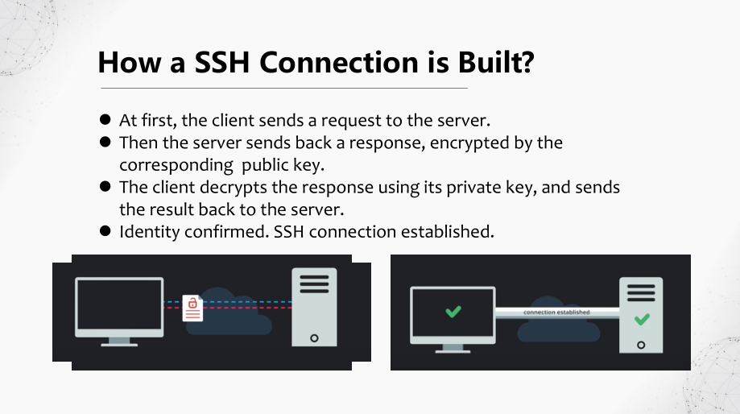
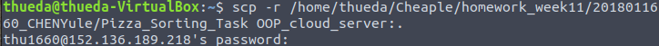
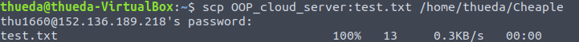

# Secure Shell (SSH)

##### CHEN Yule | 2020 May


## How SSH Works?

+ **Secure Shell (SSH)** is a cryptographic network protocol for operating
  network services securely, over an unsecured network.

+ Some SSH tools: putty, Xshell, SecureCRT, Mobaxterm.

  

+ SSH is commonly implemented using the **client-server** model.

+ A SSH connection can be set up using a pair of keys: the **public**
  **key** and the **private key**.

+ SSH also supports password-based authentication that is
  encrypted by automatically generated keys.

  

  

+ However, Secure Shell is **not** 100% secure.

+ Accepting an attacker's public key without validation will authorize an unauthorized attacker as a valid user.

  

## Some SSH Commands

#### Login & Logout

```shell
ssh username@remote –p port # build a connection
	# remote: IP address or domain name of the remote server
	# port: default 22
```


```shell
vim ~/.ssh/config
	# edit configuration file to add a connection_name to simplify the last command to the next command.
```


```shell
ssh username@remote # build a connection
```


```shell
ssh username@remote command_name
	# straightly execute a command in the server
```

```shell
logout # close the connection
```

#### Keys Generating

```shell
ssh-keygen
	# generating a public/private key pair

ssh-copy-id -i ~/.ssh/id_rsa.pub connection_name
	# store local client’s public key in remote server
	# then client is allowed to login without a password
```

#### SCP

The scp command allows you to copy files over ssh connections.

```shell
scp local/path/file connection_name:remote/path
	# transfer a local file to the remote server
	# add “-r” to transfer a folder
```



```shell
scp connection_name:remote/path/file local/path
	# download a remote file
```




## More About SSH

+ By default, when the client logs out, processes created by the client in the server are killed.
+ How to continue server’s processes after logging out?
+ Use **Tmux**.


+  Can we get the remote server’s graphical interfaces?

+ Yes. Use **X server**.

+ ```shell
  ssh –X connection_name
  ```


## Reference

+ Wikipedia contributors, "Plagiarism," *Wikipedia, The Free Encyclopedia*, https://en.wikipedia.org/wiki/Secure_Shell(accessed June 25, 2020)

