#  Markdown

Wuwei Yuan

##  Introduction

- It’s a lightweight markup language with plain-text-formatting syntax.
- Its design allows it to be converted to many output formats, including HTML, etc.
- Unlike markup languages (such as HTML and RTF), the key design goal is **readability** - that the language be readable as-is, without looking like it has been marked up with tags or formatting instructions.
- There isn’t a complete standard, because the designer thinks different sites and people have different needs.
- There are many variants of Markdown.
- It is widely used by GitHub, Bitbucket, Reddit, Diaspora, Stack Exchange, OpenStreetMap, and SourceForge. The file `README.md` is written in markdown.
- You can use Markdown in many IDEs and editors, such as CLion, Visual Studio Code, Vim, etc, with the help of plugins.

## Basic Syntaxes

These syntaxes are supported by most markdown editors.

Detailed information can be found [here](https://www.markdownguide.org/basic-syntax/).

### Headings

Codes:

```markdown
# Heading level 1

### Heading level 3

Heading level 1
===============

Heading level 2
---------------
```

Effects:

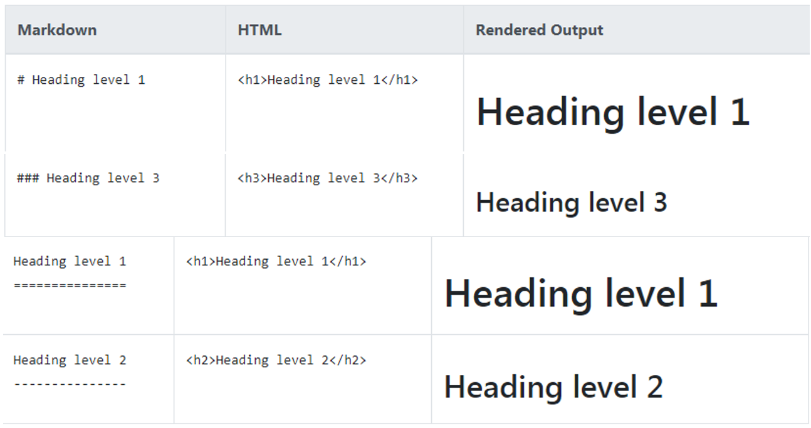

### Paragraphs and Line Breaks

Codes:

```markdown
I really like using Markdown.

I think I'll use it to format all of my documents from now on.

This is the first line.  
And this is the second line.
```

Effects:

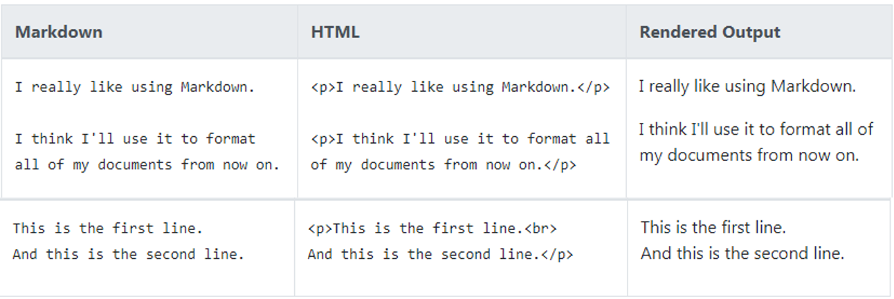

### Emphases

Codes:

```markdown
I just love **bold text**.

I just love __bold text__.

Italicized text is the *cat's meow*.

Italicized text is the _cat's meow_.

This text is ***really important***.
```

Effects:

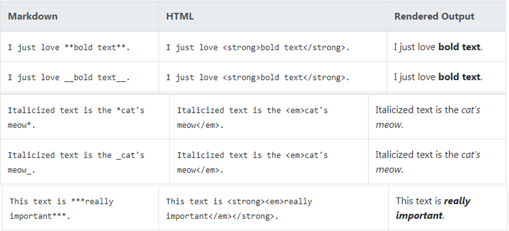

### Blockquotes

Codes:

```markdown
> Dorothy followed her through many of the beautiful rooms in her castle.

> #### The quarterly results look great!
>
> - Revenue was off the chart.
> - Profits were higher than ever.
>
>  *Everything* is going according to **plan**.
```

Effects:

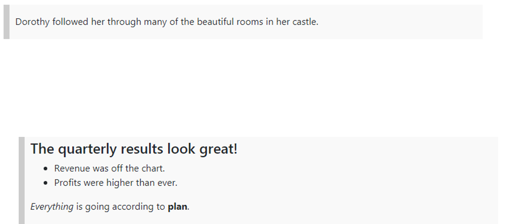

### Lists

Codes:

```markdown
1. First item
2. Second item
3. Third item
4. Fourth item

+ First item
* Second item
- Third item
+ Fourth item
```

Effects:

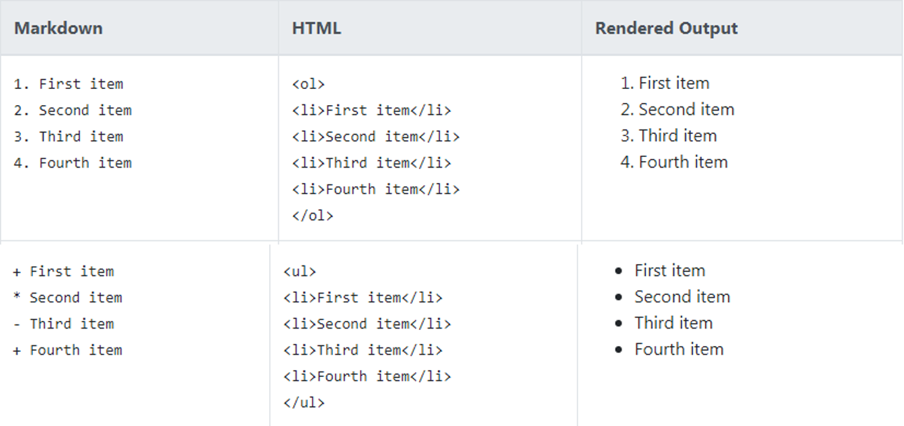

### Links

Codes:

```markdown
My favorite search engine is [Duck Duck Go](https://duckduckgo.com).
```

Effects:

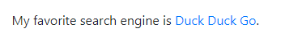

### Images

Codes:

```markdown
 
```

Effects:


### HTML Features

Codes:

```markdown
This **word** is bold. This <em>word</em> is italic.
```

Effects:

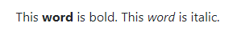

## Extended Syntaxes

These syntaxes are supported by many - not all markdown editors.

Detailed information can be found [here](https://www.markdownguide.org/extended-syntax/).

### Tables

Codes

```markdown
| Syntax      | Description | Test Text     |
| :---        |    :----:   |          ---: |
| Header      | Title       | Here's this   |
| Paragraph   | Text        | And more      |
```

Effects:

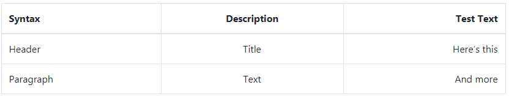

### Fences Code Blocks and Syntax Highlighting

Codes:

```markdown
​```json
{
  "firstName": "John",
  "lastName": "Smith",
  "age": 25
}
​```
```

Effects:

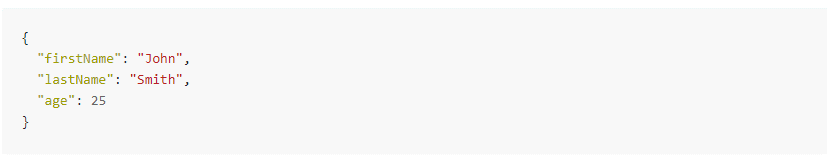

### Strikethrough 

Codes:

```markdown
~~The world is flat.~~ We now know that the world is round.
```

Effects:

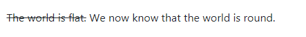


### Footnotes

Codes:

```markdown
Here's a simple footnote,[^1] and here's a longer one.[^bignote]

[^1]: This is the first footnote.
```

Effects:

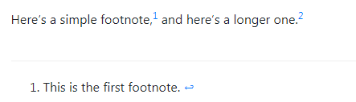

### Definition Lists

Codes

```markdown
First Term
: This is the definition of the first term.

Second Term
: This is one definition of the second term.
: This is another definition of the second term.
```

Effects:


### Task Lists

Codes:

```markdown
- [x] Write the press release
- [ ] Update the website
- [ ] Contact the media
```

Effects:

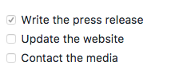

## Extensions

These features are seldom supported. Some may be plug-in functionalities.

### Math Formulas

Including some LaTeX formulas.

Codes:

```markdown
$$
\begin{bmatrix}
1&\frac{-b\pm\sqrt{b^2-4ac}}{2a}
\end{bmatrix}
$$
```

Effects:

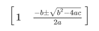

### Diagrams 

Including Sequences, Flowchart and Mermaid.

Codes:

```markdown
​```flow
a=>start
b=>end
a->b
​```
```

Effects:

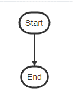

### Slides

Please search in the search engine if needs.

## Editing

There're different editors with different editing environments.

- Edit and render like other languages

- Editor with realtime preview

  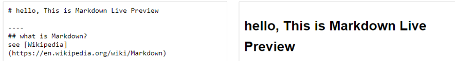

- Editor in WYSIWYG fashion

  YWSIWYG = What You See Is What You Get

  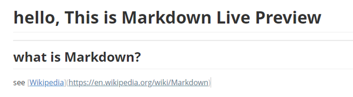

## References

- [en.wikipedia.org/wiki/Markdown](https://en.wikipedia.org/wiki/Markdown)
- [https://www.markdownguide.org/basic-syntax/](https://www.markdownguide.org/basic-syntax/)
- [https://www.markdownguide.org/extended-syntax/](https://www.markdownguide.org/extended-syntax/)