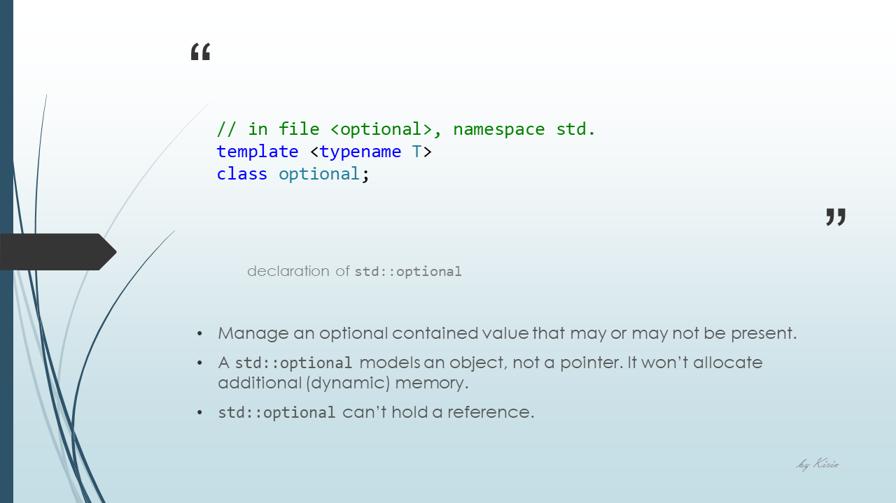

# Some New Features in C++17

## Slides

---

### References

- [structured binding](https://en.cppreference.com/w/cpp/language/structured_binding "cppreference.com")
- [fold expression](https://en.cppreference.com/w/cpp/language/fold "cppreference.com")
- [std::variant](https://en.cppreference.com/w/cpp/utility/variant "cppreference.com")
- [std::optional](https://en.cppreference.com/w/cpp/utility/optional "cppreference.com")
- [new features in C++17](https://stackoverflow.com/questions/38060436/what-are-the-new-features-in-c17 "Stack Overflow")