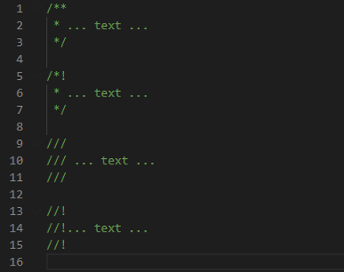
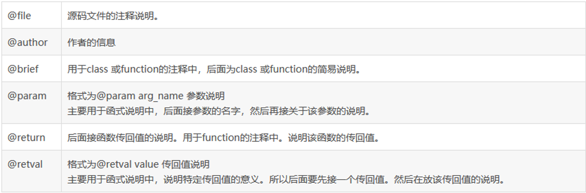
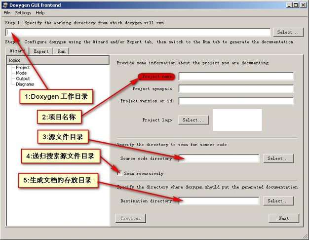
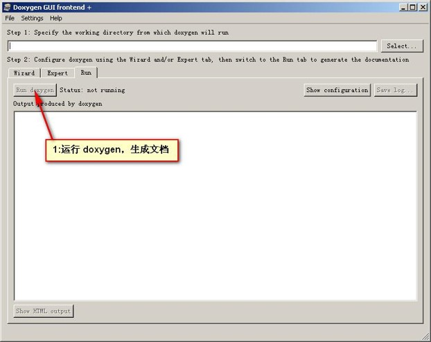

### An Introduction to Doxygen

##### cao tianyou 

#### What is Doxygen?

Doxygen is a documentation generation tool for generating documentation for source code

You can write comments according to Doxygen format requirements,Doxygen will take out the comments to generate a document

Doxygen is used for C,C++,C#,Pyton,PHP,VHDL,Java,etc.

The document formats generated by Doxygen are HTML,LaTeX,RTF,etc.

#### Install Doxygen

For Linux:

>sudo apt-get install doxygen

>sudo apt-get install doxygen-gui

For Windows:

>download at [here](www.doxygen.org/download.html)

#### Write Comments

Doxygen's comment is actually to add some additional logos on the basis of C++ comment,so that Doxygen can easily recognize

Doxygen's commnets are as followed:

The default comment is the code after the explanation, if you want to explain the previous code, you need to add $<$at the beginning of the comment, such as /**<… text… */

The commonly used instructions in Doxygen are shown in the following table (@ and \ are equivalent):

You can see the example code:example.cpp and exmample.h

#### Use GUI to use Doxygen

#### Reference

https://github.com/doxygen/doxygen

http://www.doxygen.nl/manual/docblocks.html#docexamples

https://blog.csdn.net/Candy1232009/article/details/80786179
