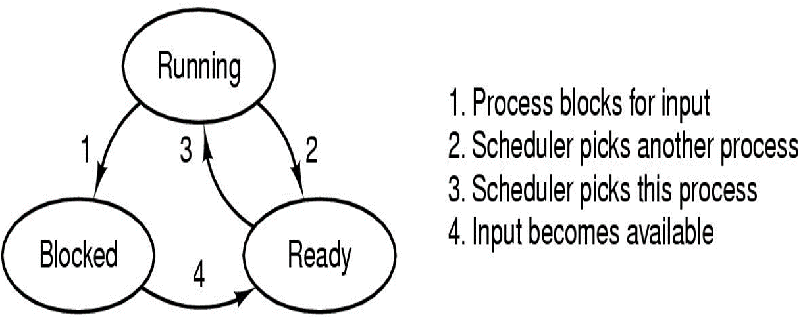
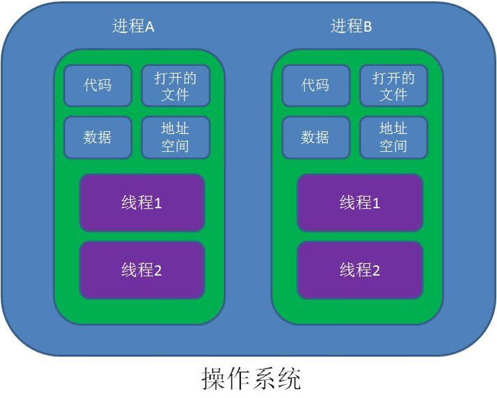
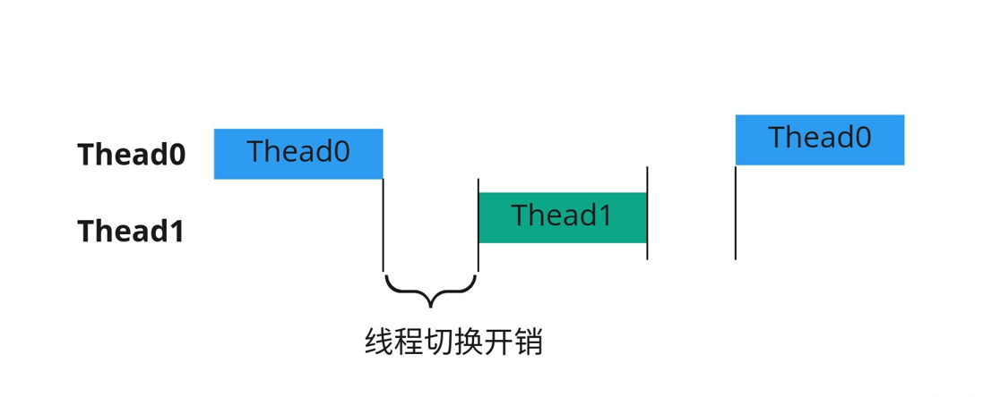
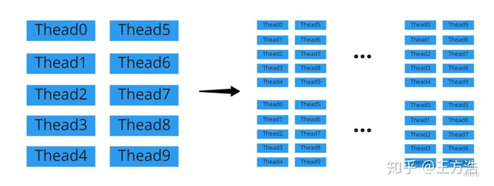
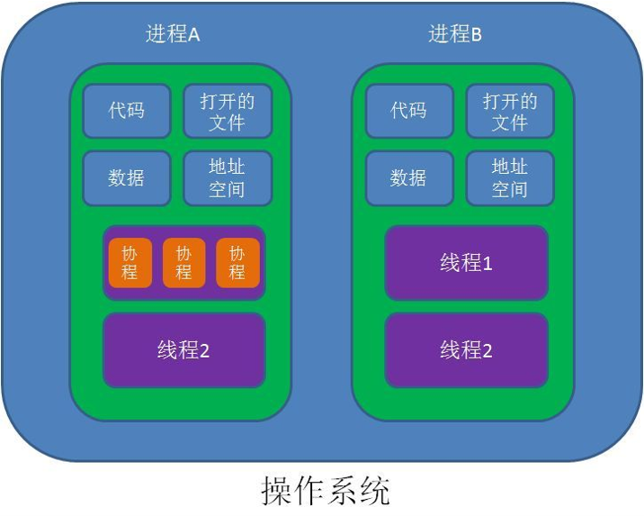

# 多线程

### 一、进程与线程

​	进程是计算机中的程序关于某数据集合上的一次运行活动，是系统进行资源分配和调度的基本单位，是操作系统结构的基础。进程中包含了正在运行的一个程序的所有状态信息（堆栈空间、代码文本、寄存器、PC指针等等）。

​	为了提高计算机系统中各种资源的利用率，现代操作系统广泛采用多道程序技术，使多个程序同时在系统中存在并运行，但多进程技术并不是同时让多道进程同时工作。一个进程只能处于运行、阻塞、就绪三种状态中的一个，其中运行状态表示此进程正在使用系统资源；阻塞状态表示此进程暂时没有准备好使用系统资源；就绪状态表示进程已经可以使用系统资源，但此时系统资源正在被其他进程使用。这三种状态之间的转移关系可由下图表示：





多进程虽然宏观上看来是电脑并行处理，但实际上计算机是通过快速切换进程处理任务而达到此效果的。

虽然多进程能够很好地满足需求，但在某些情况下，仅依靠这一项技术无法使程序达到我们所期待的性能，比如说视频播放软件的设计。

我们可以把一款视频播放软件的核心功能抽象为如下三个部分：

1. 从视频文件中读取数据
2. 将数据进行解压缩和翻译
3. 把翻译之后的音视频数据播放输出

   可用抽象代码表示为：

```c++
void main() 
{
    ...
    while(1)
    {
        READ();
        TRANSLATE();
        OUTPUT();
	}
}
```

经过分析我们不难发现，这三个核心部分其实并无严格意义上的先后顺序，但如果按此流程执行的话，很可能会因为某一步的时间开销相对大而影响视频的流畅性，我们期望能够按如下方式运行代码：

```c++
void main() 				void main()					void main()
{					{						{
    ...					    ...						    ...
    while(1)				    while(1)					    while(1)
    {					    {						    {
        READ();				        TRANSLATE();				        OUTPUT();
    }					    }						    }
}					}						}
```

于是线程这一概念就被提出。线程之间可以并发地执行；线程之间共享相同的地址空间。

线程、进程之间的关系可由下图表示：



我们可用如下两段代码来体会线程的并发性：

```java
public class MultiThread {      
    public static void main(String[] args) { 
        System.out.println("main thread starts");
        SpeakThread thread = new SpeakThread();
        thread.start();
        System.out.println("I'm eating");
        System.out.println("main thread ends");
    }
}
class SpeakThread extends Thread{
    public void run() {
        System.out.println("new thread starts");
        System.out.println("I'm speaking");
        System.out.println("new thread ends");
    }
}
```

```java
public class MultiThread {      
    public static void main(String[] args) { 
        System.out.println("main thread starts");
        SpeakThread thread = new SpeakThread();
        thread.start();
        try{Thread.sleep(1);} catch(Exception e){}		//let main thread sleep
        System.out.println("I'm eating");
        System.out.println("main thread ends");
    }
}
class SpeakThread extends Thread{
    public void run() {
        System.out.println("new thread starts");
        System.out.println("I'm speaking");
        System.out.println("new thread ends");
    }
}

```

其中第一段代码的运行结果和普通的串行运行没有区别，但第二段代码中newThread的运行却先于mainThread，这就能体现出线程是并发地运行的。

### 二、线程之间的通信

在C语言中，同一进程内的多个线程之间可通过全局变量来共享数据；在Java语言中需要创建相应的对象，然后将对象引用作为参数传给函数

但是仅仅依靠此方式来共享数据是有一定的风险的，在不同线程中并发地独写同一个变量可能会因为线程运行的快慢而产生不同的结果，比如：

```java
	Thread1										Thread2
	tmp1 = cnt;									tmp2 = cnt;
	tmp1++;										tmp2 += 2;
	cnt = tmp1;									cnt = tmp2;
```

这两个线程运行时，就有可能产生很多不同的结果：

```jav
	Thread1										Thread2
	tmp1 = cnt;												
	tmp1++;													
	cnt = tmp1;												
											tmp2 = cnt;
											tmp2 += 2;	
											cnt = 2; //cnt = 4
```

```java
	Thread1										Thread2
	tmp1 = cnt;												
											tmp2 = cnt;
											tmp2 += 2;
											cnt = tmp2;
	tmp1++;
	cnt = tmp1;	//cnt = 2
```

Java语言中引入了“互斥锁”来防止类似这种现象的发生。对象未被访问时，其锁是打开的；当对象被某个线程访问时，锁被关上，其他线程就无法访问，直至该线程访问完毕打开锁。宏观上并发执行，但微观上轮流执行。

### 三、协程

正如上一节中提到的，互斥锁的引入虽然保证了结果的唯一性，但是也带来了性能的降低。随着多线程技术的使用，人们发现两类开销可以得到进一步的优化：线程切换的开销和多线程数的额外开销，示意图如下：





据此，人们引入了协程的概念，压缩了线程数，并减少了协程间的切换开销：


协程、线程、进程之间的关系如下图所示：



### 四、总结

1. 对操作系统来说，线程是最小的执行单元，进程是最小的资源管理单元。
2. 线程可以并发地执行，线程之间可以共享相同的地址空间。
3. 线程之间进行数据共享时，要确保不会互相妨碍。
4. 协程+异步I/O = 极大提升系统性能。

### 五、参考资料

1. Java程序设计，谌卫军，清华大学出版社
2. Java多线程编程核心技术，高洪岩，机械工业出版社
3. java核心技术卷1基础知识，凯·S.霍斯特曼，机械工业出版社
4. Java编程思想, Bruce Eckel,机械工业出版社
5. https://zhuanlan.zhihu.com/p/172471249

