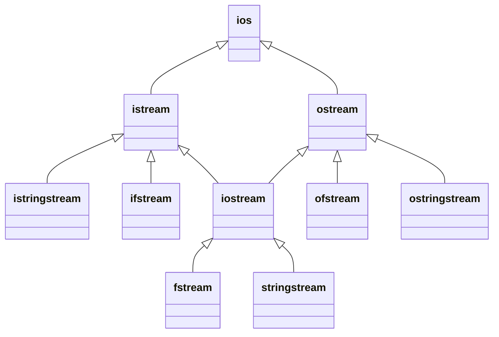
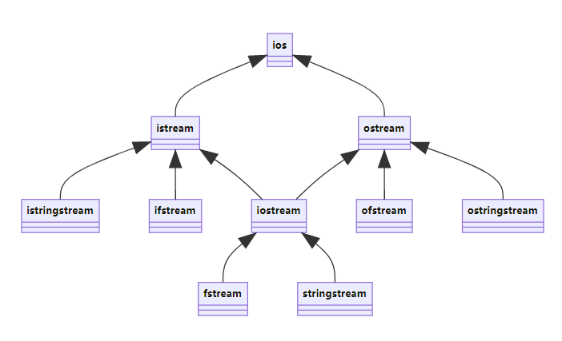

# C++中的输入输出

致理-信计01 单敬博 2021.4.6

## 输入输出(IO)

 从哪输入? 向哪输出? 

- 控制台
- 文件
- 字符串

 输入输出什么? 

- `bool`
- `int`
- `double`
- `char*` (`string`)
- 自定义类

 按什么格式输出?

- `bool`: `1` 还是 `true`;
- ­16进制: `1BF52`;
- ­占5位的`int`, 显示`+`号, 空位补`0`: `+0233`;
- ­保留小数点后两位的`double`: `3.14`

速度如何? 如何加速?

## “文件”

> `1.in`  `a.out`  `ContactEmail.txt`

­这些都是文件, C++能够对它们进行读写操作

**控制台**也是一个“**文件**”

- 在Dos/Windows系统中它的名字是`CON`; 在其他操作系统中是`/dev/tty`
- ­程序通过对这个“**文件**”的读写操作, 实现从控制台的输入输出

## C风格

### `FILE*`

`FILE` 为C中的定义的对象类型, 常称作**C流**，每个实例与一个 “文件”关联, 只能通过`FILE*`类型指针进行访问及操作

`<stdio.h>`中预定义的标准流: 

- `­stdin`：**标准输入**, 默认关联到控制台, 可能有缓冲区
- `stdout`：**标准输出**, 默认关联到控制台, 可能有缓冲区
- ­`stderr`: **标准错误**, 默认关联到控制台, 无缓冲

文件访问操作:

- `­fopen`(打开文件): `FILE* inputFile = fopen("1.in", "r");`
- `freopen`(重新打开文件): `freopen("2.in", "r", stdin);`
- `­fclose`(关闭文件): `fclose(inputFile);`

文件读写操作:

- `fread`(直接读取): `fread(buf, sizeof(char), n, stdin);`
- `fwrite`(直接写入): `fwrite(buf, sizeof(char), n, stdout);`
- ­`getchar`/`gets`/`fgetc`/`fgets`(读取一个字符/一整行)
- `­putchar`/`puts`/`fputc`/`fputs`(写入一个字符/一整行)

### 格式化输入

`scanf`(从`stdin`), `fscanf`(从`FILE*`), `sscanf`(从`char*`)

`int`型的返回值:

- `>= 0` 时表示成功输入的参数个数; 
- ­`== 0` 时表示在首个参数赋值前发生匹配失败;
- `== EOF(=-1)` 时表示在首个参数赋值前出现输入失败(如: 输入文件结束)

### 格式化输出

`printf`(`stdout`), `fprintf`(`FILE*`), `sprintf`(`char*`)

 `int`型返回值:

- `>= 0` 时表示写入的字符数;
- `< 0` 表示发生错误

举例:

- `­bool`: `printf("%s", true ? "true" : "false");`
- ­16进制: `printf("%X",114514);`
- ­占5位的`int`, 显示`+`号, 空位补`0`: `printf("%+05d",233);`
- 保留小数点后两位的`double`: `printf("%.2f",3.14159);`

## C++风格

### 流(stream)类





`istream cin`: 通过C流`stdin`输入, 可以通过重新打开`stdin`实现把输入重定向到文件

`ostream cout`: 通过C流`stdout`输出

`ostream cerr, clog`: 通过C流`stderr`输出, `cerr`无缓冲区; `clog`有缓冲区

### 流与文件

 使用`(i/o)fstream`类对象, 可以实现文件读写:

```cpp
ifstream mycin("1.in");
ofstream mycout("1.out");
mycin >> a >> b;
mycout << a + b << endl;
```

### 流类中的函数

`istream`

- ­`istream& operator >>(T& value)`: 输入value, 返回自身的引用;
- `­operator bool()`: 返回是否出错(如: 输入文件结束);
- ­`int get()` / `istream& get(char& c)`: 输入一个字符;
- `istream& getline(char* buf, int bufSize[, char delim])`;
- ­`istream& ignore(int n=1, int delim=EOF)`: 忽略n个字符

`ostream`

- `ostream& operator <<(const T& value)`: 输出value
- ­`ostream& put(char c)`: 输出一个字符

### 自定义类的输入输出

```cpp
struct Point { double x, y; } p1;
istream& operator >>(istream& is, Point& p) {
   return is >> p.x >> p.y;
}
ostream& operator <<(ostream& os, const Point& p) {
    return os << "(" << p.x << "," << p.y << ")";
}
// in main():
cin >> p1;
cout << p1 << endl;
```

### 流操纵算子

C++通过**流操纵算子**设置流类的输入输出格式

大部分流操纵算子定义在头文件`<iomanip>`中，常用的有:

- ­`hex`/`dec`/`oct`: 以16/10/8进制输入输出;
- `­fixed`: 强制以普通小树(而不是科学计数法)输出浮点数;
- `­setw(int)`: 设置输入输出的宽度;
- ­`setfill(char)`: 设置填充字符;
- `­setprecision(int)`: 设置输出浮点数的精度;
- `­flush`: 清空缓冲区;
- **`­endl`: 结束一行, 隐含`flush`**

举例:

- ­`bool`: `cout << boolalpha << true;`
- ­16进制: `cout << hex << uppercase << 114514;`
- ­占5位的`int`, 显示`+`号, 空位补`0`: `cout << showpos << setw(5) << internal << setfill('0') << 233;`
- ­保留小数点后两位的`double`: `cout << fixed << setprecision(2) << 3.14159;`

###  C++20::`<format>`

`<format>`从第三方库`fmtlib`发展而来, **目前还没被实现出来**

举例:

- `­bool`: `cout << format("{:s}", true);` 
- 16进制: `cout << format("{:X}", 114514);`
- 占5位的`int`, 显示`+`号, 空位补`0`: `cout << format("{:+05d}", 233);`
- 保留小数点后两位的`double`: `cout << format("{:.2f}", 3.14159);`

多参数输出

```cpp
format("{}, {}", 1, "a");             // 1, a
format("{0:},{0:+},{0:-},{0: }", 1);  // 1,+1,1, 1
format("{1},{0},{1}", 1, 2);          // 2,1,2
```

更复杂的格式

- ­居中对齐: `format("{:*^6}", 'x'); // **x***`

支持**自定义类型**的输出(需要实现一个`formatter`)

## 高级用法：­输入直到文件结束

### ­C::`scanf`

输入结束时`scanf`返回`EOF(-1)`

```cpp
while(~ scanf("%d", &n)) {
  // do something
}
```

### C++::`cin`

输入结束时`cin`被转换为`false`

```cpp
while(cin >> n) {
  // do something
}
```

## IO竞速

### 输入速度

从`stdin`:

- ­**task1**: 输入10^6^个`int`
- **task2**: 输入10^6^个`double`

|    方法     | task1 | task2 |
| :-------------: | :-------: | :-------: |
|    `scanf`     |   0.60s   |   <font color=green>1.42s</font>   |
|    `cin`    |   <font color=red>1.24s</font>   |   <font color=red>5.75s</font>   |
| `cin`(关闭同步) |   0.44s   |   4.45s   |
|  `getchar`   |   0.19s   |     -     |
|    `fread`    |   <font color=green>0.03s</font>   |     -     |

### 输出速度

向`stdout`:

- **task1**: 输出10^6^个`int`, **每行一个**
- **task2**: 输出10^6^个`int`, **空格分隔**
- ­**task3**: 输出10^6^个`double`, 保留两位小数, **空格分隔**

|      方法      |             task1              |             task2              |             task3              |
| :------------: | :----------------------------: | :----------------------------: | :----------------------------: |
|    `printf`    |             2.03s              |  <font color=red>2.03s</font>  | <font color=green>2.35s</font> |
| `cout`(`endl`) |  <font color=red>4.79s</font>  |             0.42s              |  <font color=red>2.95s</font>  |
| `cout`(`'\n'`) |             0.44s              |             0.44s              |  <font color=red>2.95s</font>  |
|   `putchar`    |             0.21s              |             0.21s              |               -                |
|    `fwrite`    | <font color=green>0.04s</font> | <font color=green>0.04s</font> |               -                |

## ­参考资料

- [cppreference](https://zh.cppreference.com/w/首页): [C](https://zh.cppreference.com/w/cpp/io/c)[风格文件输入](https://zh.cppreference.com/w/cpp/io/c)[/](https://zh.cppreference.com/w/cpp/io/c)[输出](https://zh.cppreference.com/w/cpp/io/c) | [输入](https://zh.cppreference.com/w/cpp/io)[/](https://zh.cppreference.com/w/cpp/io)[输出库](https://zh.cppreference.com/w/cpp/io) | [格式化库](https://zh.cppreference.com/w/cpp/utility/format)
- 郭炜. 新标准 C++ 程序设计. 北京: 高等教育出版社, 2016. 
