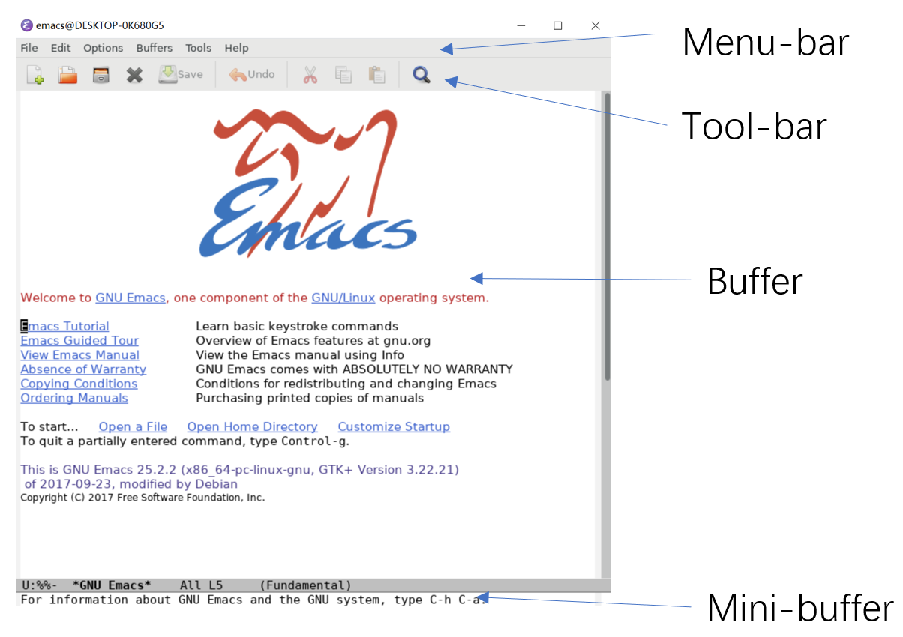

# 8分钟Emacs简单上手

## Emacs是什么？

Emacs是一个功能强大的文本编辑器(Editor)。

Emacs的全称是Editor MARCros（编辑器宏）。

由于开源性，Emacs产生了若干分支，目前比较常用的有GNU Emacs和XEmacs。

## Emacs可以用来做什么？

写代码 & 调试程序

网上冲浪

收发邮件

记日记，管理日程

玩游戏

煮咖啡（超文本咖啡壶控制协议，简称HTCPCP，Emacs完全兼容该协议）

在Emacs中使用Emacs或Vim

使用Telegram

## Emacs的基本构造

一个最基础emacs界面如下图所示。

一般来说，我们进行的文本编辑工作均是在buffer中完成的

## Emacs的基本操作

C代表Ctrl键，M代表Alt或mac上的option键。

以下是几个快捷键表达的例子：

C-x代表Ctrl和x同时按下。C-x C-c代表先按C-x,再按C-c。

C-x k代表先按下C-x，松手，按下k。

关闭Emacs：C-x C-c

打开（没有则新建）文件：C-x C-f

保存文件：C-x C-s

取消当前操作/不完整的快捷键：C-g

输入指令：M-x （支持tab自动补全）

复制：M-w                剪切：C-w

粘贴：C-y                 全选：C-h

撤销：C-/

把光标所在行移到窗口的中央：C-l

运行一条shell指令：M-!

## Buffer

在Emacs中可以打开多个文件，每一个文件都会以buffer的形式被打开在Emacs中。

列出所有buffer：C-x C-b

在buffer之间切换：C-x b

关闭buffer：C-x k

## Mode

Emacs中的一个重要的概念便是mode（模式），它分为major-mode和minor-mode两种。

其中major-mode在一个buffer中只能开启一个，一般是用来区分不同语言的（C++ or python etc.）。

而minor-mode在一个buffer中开启的数量是不限的，一般用来开启插件的一些功能。

## Packages

Emacs的一个真正强大的地方是它可以安装package，可以理解为插件。

Emacs内置了包管理器ELPA，并且在tuna上有镜像。

通过ELPA安装插件的具体方法是：

M-x package-install RET <package_name> RET或M-x package-list-packages 调出一个buffer后进行选择，用i标记要安装的package后按x安装。

这里列举一些常用的packages：

- yasnippet 一个管理snippet的package，可以用来快速插入代码块（通过几个单词）。

- flycheck 可以提供实时的代码的编译错误。

- company 代码补全。

Packages使用elisp进行编写。•elisp是函数式编程语言lisp的一种方言。

## Customize

Emacs另一个强大的地方便是可定制化。

你通过写配置文件来实现你想做的几乎任何事情。 

- (setq-default cursor-type ‘bar) ;;将光标设置为细条状而不是一个方块。

- (show-paren-mode t) ;; 在括号处高亮与之匹配的括号

- (global-linum-mode t) ;; 显示行号

此外，你还可以安装主题使你的编辑器更加美观。

可以看到，上面三个例子式通过打开一些minor-mode或者修改一些变量的值来进行定制化的，你可以在Emacs的Document中找到更多可修改的变量。

## Miscs

值得一提的是，Emacs会默认开启auto-indent，自动帮你进行缩进管理。如果它默认的缩进格式你不喜欢可以自己调节。
