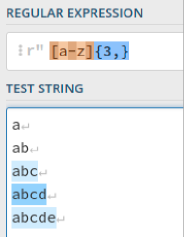
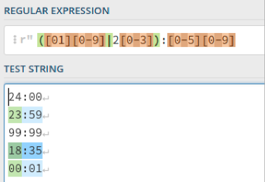
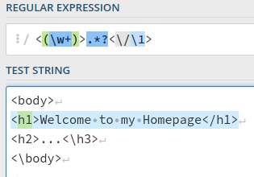
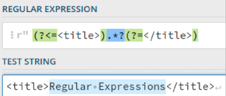
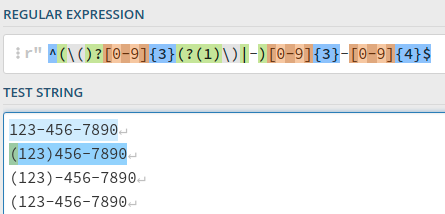

# 正则表达式简介

张傲  2021年4月27日课堂展示

## 正则表达式 \(Regular Expression\)

* 强大、便捷、高效的文本处理工具
* 由正则引擎将表达式匹配为字符串
* posix正则表达式规范：BRE和ERE
* grep等工具支持正则表达式

## 正则表达式的应用

* 搜索文件，查找特定规则的字符串
* 检查文件中字符串的格式
* 处理URL、代码注释等

## 正则表达式基本语法

### 匹配字符和位置匹配

* 元字符\(metacharacter\)：相对于“原义文本字符”而言，具有特殊含义，代表的不是本身的字符。要表示这些字符需要用反斜杠转义。
* 例如： 
* 位置匹配：^ $ \\b \\B不匹配字符，只用于限制匹配字符的位置。
* 不同语言支持的特殊字符可能不同
* 特殊字符表：

| 元字符 | 含义 |
| ------ | ------ |
| . | 任何字符，\\n除外 |
| \[\] | 字符集 |
| \\ | 转义 |
| ^ | 字符集取反 |
| \- | 字符集范围，如0-9 |
| ^ | 字符串开头 |
| $ | 字符串结尾 |
| \[\\b\] | 退格符 |
| \\b | 单词的边界 |
| \\B | 单词的非边界 |
| \\d | 数字字符，相当于\[0\-9\] |
| \\D | 非数字字符，相当于\[^0\-9\] |
| \\n | 换行符 |
| \\r | 回车符 |
| \\s | 空白字符，包括\\n,\\r,\\f,\\t,\\v等 |
| \\S | 非空白字符 |
| \\t | 制表符 |
| \\v | 垂直制表符 |
| \\w | 可以组成单词的字符，相当于\[a\-zA\-Z0\-9\]
| \\W | 不可以组成单词的字符 |

### 重复匹配

* 重复匹配能匹配任意多个字符。
* “贪婪型”和“懒惰型”：程序会匹配尽可能长的字符串。如在元字符后加问号\(\?\)则匹配尽可能短的字符串。
* 例如：
* 特殊字符表：

| 元字符 | 含义 |
| ------ | ------ |
| \* | 匹配前一个字符任意次 |
| + | 匹配至少一次 |
| \? | 匹配至多一次 |
| \{n\} | 匹配n次 |
| \{n,\} | 匹配至少n次 |
| \{n,m\} | 匹配n至m次 |

### 子表达式

* 子表达式：将多个字符作为单一实体使用。可嵌套。
* 例如：
* 特殊字符表：

| 元字符 | 含义 |
| ------ | ------ |
| \(\) | 子表达式 |
| \| | 逻辑或 |

### 反向引用

* 反向引用：用一个实体代表先前出现的子表达式。
* 例如：
* 特殊字符表：

| 元字符 | 含义 |
| ------ | ------ |
| \\1 | 代表第1个括号中的子表达式 |

### 环视

* 标记匹配字符串的前后文本。
* 例如：
* 特殊字符表：

| 元字符 | 含义 |
| ------ | ------ |
| \(\?=\) | 顺序环视 |
| \(\?\<=\) | 逆序环视 |
| \(\?!\) | 否定式顺序环视 |
| \(\?\<!\) | 否定式逆序环视 |

### 条件

* 根据表达式是否存在匹配相应模式。
* 例如：
* 特殊字符表：

| 元字符 | 含义 |
| ------ | ------ |
| \(\?\(1\)a\) | 若第1个反向引用存在则匹配a。括号中的1可改为环视条件 |
| \(\?\(1\)a\|b\) | 若第1个反向引用存在则匹配a，否则匹配b。括号中的1可改为环视条件 |

## 正则表达式的使用

* Shell中的正则表达式：使用grep/egrep，sed，awk
* 查找：`egrep -n "RegEx" filename`
* 替换：`sed -ri "s/foo/bar/g" filename`

* python中的正则表达式：re模块中的match，search等方法

* c++中的正则表达式：头文件\<regex\>，regex类

## 参考文献和网页

1. 福尔塔 B, 门佳, 杨涛 正则表达式必知必会\[M\]. 北京: 人民邮电出版社, 2019.
2. 弗里德尔 J E F, 余晟 精通正则表达式\[M\]. 北京: 电子工业出版社, 2007.
3. <https://regex101.com/>
4. <https://www.w3cschool.cn/zhengzebiaodashi/regexp-syntax.html>
