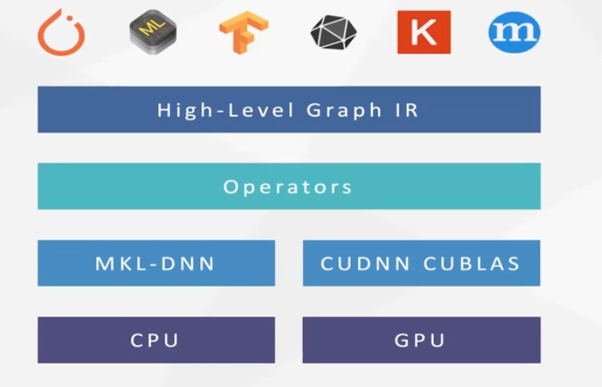
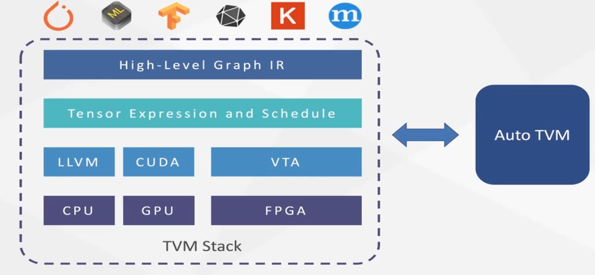

# TVM

## TVM 简介
TVM 是一个端对端的深度学习编译器，自动为各种硬件生成可部署的优化代码。

在传统深度学习模型中，需要基于硬件厂商提供的算子构建工具来构建算子，难以从算子内进行优化。


而 TVM 则允许用户自己构建算子，优化算子并自动生成可部署的代码，然后通过对应的编译器编译后即可运行在对应的硬件上。


## TVM 安装教程
TVM 是一个开源项目，代码托管在 GitHub 上。
```bash
git clone --recursive https://github.com/apache/tvm tvm
cd tvm
```

1. 首先解决依赖问题

```bash
sudo apt-get update
sudo apt-get install -y python3 python3-dev python3-setuptools gcc libtinfo-dev zlib1g-dev build-essential cmake libedit-dev libxml2-dev
```

    最低依赖版本：
    1. 支持 c++14 的 c++ 编译器 (g++ 5 or higher)
    2. 较新版本的CMake (CMake 3.5 or higher)
    3. 推荐使用 LLVM 来支持所有的特性 (Clang)
    4. 如果需要使用 CUDA (CUDA 8.0 or higher)

2. 然后就是 cmake 的一般流程

```bash
mkdir build
cp cmake/config.cmake build
cd build
cmake ..
make -j
```

可以通过修改 `build/config.cmkae` 来配置编译选项：
```cmake
set(USE_CUDA OFF) -> set(USE_CUDA ON) (or OpenCL, ROCM, METAL, VULKAN, …)
```

3. tvm 支持各种语言，这里我们使用最受欢迎的 `python`，下面解决 `python` 依赖

```bash
pip3 install --user numpy decorator attrs
```

4. 安装完成后将编译得到的 shared libraries 加入 `python` 的 `PATH` 中

```bash
export TVM_HOME=/path/to/tvm
export PYTHONPATH=$TVM_HOME/python:${PYTHONPATH}
```

## TVM 实战

先在 `python` 中引入 TVM 的库：
```python
import tvm
import tvm.testing
from tvm import te
import numpy as np

tgt_host = "llvm"
tgt = "cuda"
```

看一段简单的定义和计算代码：
```python
n = te.var("n")
A = te.placeholder((n,), name="A")
B = te.placeholder((n,), name="B")
C = te.compute(A.shape, lambda i: A[i] + B[i], name="C")
```
解释一下其中包含的函数：
1. `te.var` 定义一个变量(variable)，可以设置 name 和 dtype
2. `te.placeholder` 定义一个向量(tensor)，必须设置 shape，可以 dtype 和 name
3. `te.compute` 通过计算生成一个向量(tensor)，必须设置 shape，fcompute，可以设置 name 和 tag

然后我们生成 `Schedule`，这是一个编译的中间过程，在这个过程中允许用户自己对程序进行 split 和 bind 来实现并行(目前有两个自动 Schedule 的方法——autotvm 和 autoschedule)。
```python
s = te.create_schedule(C.op)

bx, tx = s[C].split(C.op.axis[0], factor=64)

if tgt == "cuda" or tgt == "rocm" or tgt.startswith("opencl"):
    s[C].bind(bx, te.thread_axis("blockIdx.x"))
    s[C].bind(tx, te.thread_axis("threadIdx.x"))
```

根据 `Schedule` 来构建代码：
```python
fadd = tvm.build(s, [A, B, C], tgt, target_host=tgt_host, name="myadd")

if tgt == "cuda" or tgt == "rocm" or tgt.startswith("opencl"):
    dev_module = fadd.imported_modules[0]
    print("-----GPU code-----")
    print(dev_module.get_source())
else:
    print(fadd.get_source())
```

然后就可以使用对应生成的算子了：
```python
ctx = tvm.context(tgt, 0)

n = 1024
a = tvm.nd.array(np.random.uniform(size=n).astype(A.dtype), ctx)
b = tvm.nd.array(np.random.uniform(size=n).astype(B.dtype), ctx)
c = tvm.nd.array(np.zeros(n, dtype=C.dtype), ctx)
fadd(a, b, c)
tvm.testing.assert_allclose(c.asnumpy(), a.asnumpy() + b.asnumpy())
```

## TVM 的优势
1. 首先，肯定是因为不同硬件上的变成方式各不相同，使用编译器的方式简化编程，解决部署在不同平台的需求。
2. 其次，通过 Schedule 的过程来提高代码运行效率，使程序更高效，同时具备自动优化的能力，更加方便。
