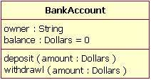
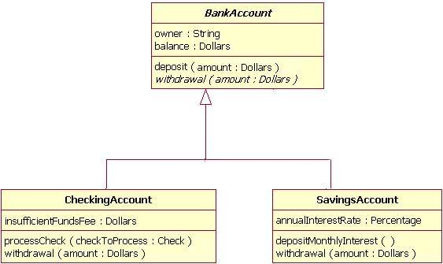
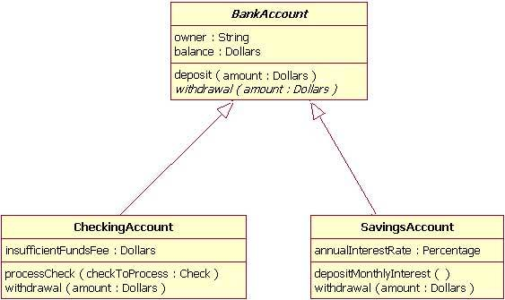
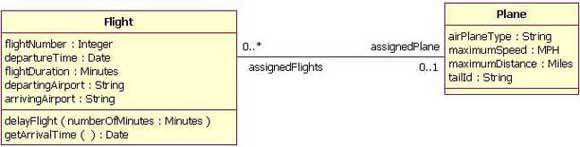
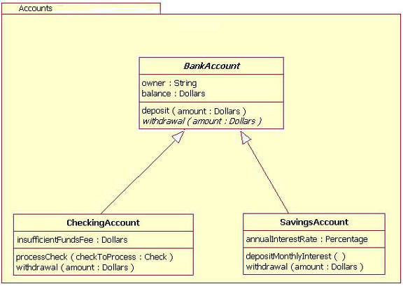
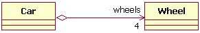
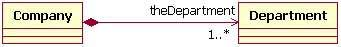

# UML and Class Diagram 

##### Shi Pengyang 2020011627

## What is UML?

+ **UML** , standing for the Unified Modeling Language , is a general-purpose, developmental, modeling language in the field of software engineering that is intended to provide a standard way to visualize the design of a system.

+ The creation of UML was originally motivated by the desire to standardize the disparate notational systems and approaches to software design.

+ UML offers a way to visualize a system's architectural blueprints in a diagram, including elements such as:
  - any activities (jobs);
  - individual components of the system;
and how they can interact with other software components;
  - how the system will run;
  - how entities interact with others (components and interfaces);
  -  external user interface.

 + Although originally intended for object-oriented design documentation, UML has been extended to a larger set of design documentation (as listed above),and been found useful in many contexts.

## Class Diagram in UML
We show examples of the class diagram in UML in the following.
#### Class

+ It's an example of a concrete class , also can denote an abstract class when there is simply no member variables.Note the way member variables and functions are shown ,also that we can set default values. 

#### Inheritance

+ This example use tree notation , however , arrowhead is also available

#### Association

+ Place a role name and a multiplicity value and each end of the line to denote the association explictly.

#### Package

+ Package is a term in Java , which is like namespace in C++.

#### Aggregation

#### Composition

+ Note that the notations of aggregation and composition differs slightly due to  there similarity.

## Conclusion

+ There are at least two important reasons for understanding the class diagram. The first is that it shows the static structure of classifiers in a system; the second reason is that the diagram provides the basic notation for other structure diagrams prescribed by UML.

## Reference

+ Unified Modeling Language from **Wikipedia** https://en.jinzhao.wiki/wiki/Unified_Modeling_Language(accessed June 6, 2021)
+ Notations of class diagram comes from https://developer.ibm.com/articles/the-class-diagram/#main(accessed June 6, 2021)
